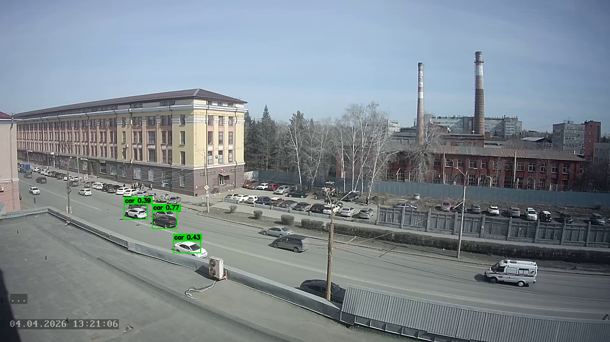
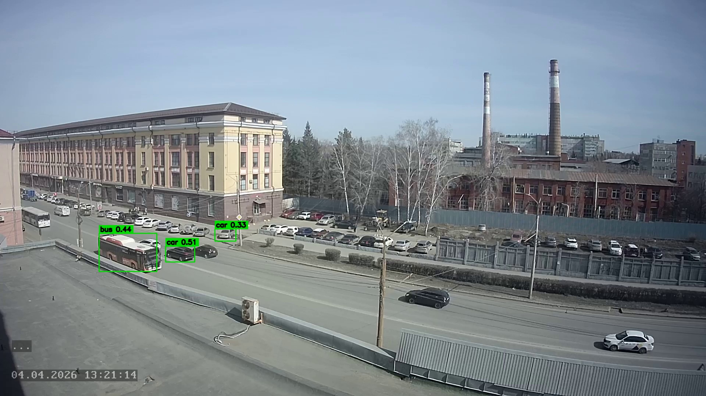

# transport-analytics-platform

Локальный проект для обработки дорожного видео и исторических данных.

## Что внутри
- PostgreSQL со схемами `raw`, `core`, `dm`, `ops`
- batch-пайплайн для CSV
- video pipeline на `YOLO Ultralytics`
- live-режим с обработкой коротких сегментов
- представления для BI

## Структура
- `src/` - код
- `scripts/` - запуск
- `sql/init/` - SQL
- `data/` - входные файлы
- `notebooks/` - ноутбук
- `ARCHITECTURE.md` - краткая схема
- `assets/readme/` - примеры детекции

## Примеры

Кадр с детекцией:



Кадр из live-просмотра:



GIF с live-детекцией:


## Запуск
```bash
cp .env.example .env
bash scripts/setup_env.sh
bash scripts/start_postgres.sh
bash scripts/init_db.sh
bash scripts/run_batch.sh
bash scripts/run_streaming.sh
```

Сквозной запуск:
```bash
bash scripts/run_all.sh
```

Остановка БД:
```bash
bash scripts/stop_postgres.sh
```

## Потоковый режим
```bash
bash scripts/run_streaming.sh --source "<video_or_stream_source>"
```

Live-просмотр:
```bash
bash scripts/run_live_view.sh --source "<video_or_stream_source>"
```

В окне и в консоли показываются:
- `frame_counts` - объекты на текущем кадре
- `active_tracks` - активные подтверждённые объекты
- `lifetime_tracks` - суммарный счётчик объектов с начала запуска
- `new_last_10s` - новые объекты за последние 10 секунд

Пример под быструю дорогу:
```bash
bash scripts/run_live_view.sh \
  --source "<video_or_stream_source>" \
  --scene-preset fast_road \
  --renderer ffplay \
  --log-level INFO
```

## Настройка viewer
Основные параметры:
- `--target-fps` - частота кадров для обработки
- `--imgsz` - размер входа модели
- `--confidence` - порог детекции

Калибровка счётчика:
- `--stitch-gap-seconds` - сколько времени держать трек живым
- `--stitch-distance-px` - на каком расстоянии сшивать один и тот же объект
- `--stitch-min-iou` - минимальное перекрытие bbox для сшивки в плотном потоке
- `--reid-memory-seconds` - сколько помнить недавно пропавший объект
- `--reid-distance-px` - на каком расстоянии возвращать пропавший объект в тот же трек
- `--min-track-hits` - сколько подтверждений нужно новому объекту
- `--edge-min-track-hits` - отдельный порог для объектов у края кадра

Подавление дублей и статичного мусора:
- `--overlap-iou` - насколько агрессивно подавлять перекрывающиеся bbox
- `--static-duration-seconds` - через сколько секунд статичный ложный объект блокируется
- `--static-movement-px` - какой сдвиг считать почти неподвижным
- `--static-min-hits` - сколько наблюдений нужно перед блокировкой статичного ложного объекта
- `--suppression-padding-px` - размер зоны вокруг статичного ложного объекта

## Что пишется в БД
Таблицы:
- `ops.pipeline_runs`
- `ops.data_quality_checks`
- `raw.tracking_source_rows`
- `raw.traffic_30min_source`
- `core.detection_events`
- `core.tracked_objects`
- `dm.streaming_metrics`
- `dm.batch_metrics`

Представления:
- `dm.v_datalens_live_traffic`
- `dm.v_datalens_historical_traffic`
- `dm.v_datalens_vehicle_mix`
- `dm.v_datalens_stream_vs_history`
- `dm.v_datalens_traffic_all`

## Проверка
```bash
psql -h /tmp/traffic_pg_socket -p 55432 -U transport_user -d transport_analytics -c "SELECT COUNT(*) FROM core.detection_events;"
psql -h /tmp/traffic_pg_socket -p 55432 -U transport_user -d transport_analytics -c "SELECT COUNT(*) FROM dm.streaming_metrics;"
psql -h /tmp/traffic_pg_socket -p 55432 -U transport_user -d transport_analytics -c "SELECT COUNT(*) FROM dm.batch_metrics;"
```

## Ограничения
- скорость по видео считается как proxy
- качество детекции зависит от камеры
- стабильность live зависит от доступности потока и `ffmpeg/yt-dlp`
- исторический CSV не является готовой train-разметкой для YOLO
