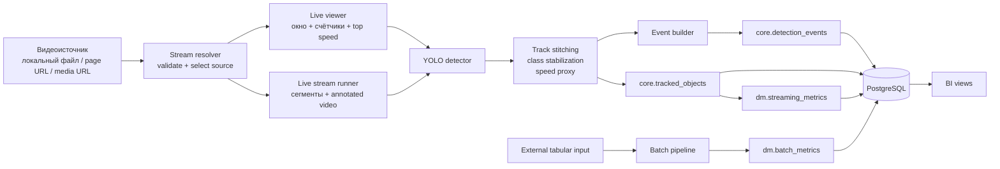
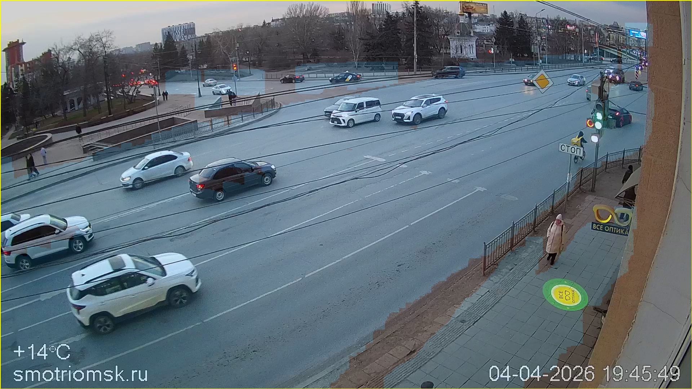

# transport-analytics-platform

Локальный проект для обработки дорожного видео и внешних входных данных.

## Назначение
- PostgreSQL со схемами `raw`, `core`, `dm`, `ops`
- batch-пайплайн для внешних табличных данных
- video pipeline на `YOLO Ultralytics`
- live viewer для визуального мониторинга
- витрины для BI
- автоматическое извлечение playable stream из прямых media URL и поддерживаемых HTML player pages

## Схема работы


## Пример работы


## Выделение дороги



Это нужно для того, чтобы сократить ложные срабатывания вне рабочей зоны кадра и не считать случайные объекты на фоне.

Как это делается:
- по видеопотоку накапливается маска движения
- из неё берётся рабочая зона дороги
- дальше детекция и фильтрация опираются уже на эту зону, а не на весь кадр целиком

## Структура
- `src/` - код
- `scripts/` - запуск
- `sql/init/` - SQL-инициализация
- `notebooks/` - пример анализа
- `ARCHITECTURE.md` - краткая схема
- `RUN_MODES.md` - режимы запуска и калибровка
- `.env.example` - шаблон конфигурации входных данных и окружения

## База данных
Схемы:
- `raw`
- `core`
- `dm`
- `ops`

Основные таблицы:
- `ops.pipeline_runs`
- `ops.data_quality_checks`
- `raw.tracking_source_rows`
- `raw.traffic_30min_source`
- `core.detection_events`
- `core.tracked_objects`
- `dm.streaming_metrics`
- `dm.batch_metrics`

Что хранится в `core.detection_events`:
- `frame_ts`
- `frame_no`
- `track_id`
- `class_name_raw`
- `vehicle_class`
- `confidence`
- `centroid_x`
- `centroid_y`
- `bbox_x1`
- `bbox_y1`
- `bbox_x2`
- `bbox_y2`
- `speed_proxy`

Что хранится в `core.tracked_objects`:
- `track_id`
- `vehicle_class`
- `first_seen_ts`
- `last_seen_ts`
- `duration_seconds`
- `detections_count`
- `start_centroid_x`
- `start_centroid_y`
- `end_centroid_x`
- `end_centroid_y`
- `distance_proxy`
- `speed_proxy`
- `speed_kmh_estimated`

Витрины:
- `dm.v_datalens_live_traffic`
- `dm.v_datalens_historical_traffic`
- `dm.v_datalens_vehicle_mix`
- `dm.v_datalens_stream_vs_history`
- `dm.v_datalens_traffic_all`

## Метрики
Streaming и batch слой считают:
- интенсивность потока
- состав потока по классам
- `avg_speed_proxy`
- `occupancy_proxy`
- `congestion_proxy`
- `heavy_vehicle_share`

Важно:
- координаты в streaming-событиях сейчас хранятся в пикселях кадра
- скорость по видео считается как proxy / estimate
- `km/h est` без калибровки камеры не является физически точным измерением

## Проверка БД
```bash
psql -h /tmp/traffic_pg_socket -p 55432 -U transport_user -d transport_analytics -c "SELECT COUNT(*) FROM core.detection_events;"
psql -h /tmp/traffic_pg_socket -p 55432 -U transport_user -d transport_analytics -c "SELECT COUNT(*) FROM core.tracked_objects;"
psql -h /tmp/traffic_pg_socket -p 55432 -U transport_user -d transport_analytics -c "SELECT COUNT(*) FROM dm.streaming_metrics;"
psql -h /tmp/traffic_pg_socket -p 55432 -U transport_user -d transport_analytics -c "SELECT COUNT(*) FROM dm.batch_metrics;"
```

## Режимы запуска
Все команды запуска, live viewer, streaming, batch и калибровка параметров вынесены в [RUN_MODES.md](RUN_MODES.md).

Репозиторий не включает входные данные. Пути к видео и табличным источникам задаются через параметры запуска и переменные окружения.

## Ограничения
- качество детекции зависит от сцены и мощности машины
- live viewer на CPU при плотном потоке может терять часть объектов
- стабильность live зависит от доступности потока и `ffmpeg/yt-dlp`
- пользовательские табличные входы не являются готовой train-разметкой для YOLO
